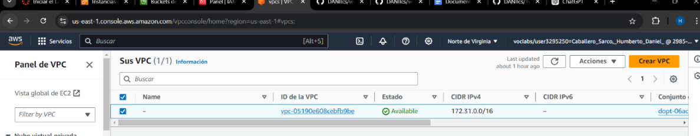
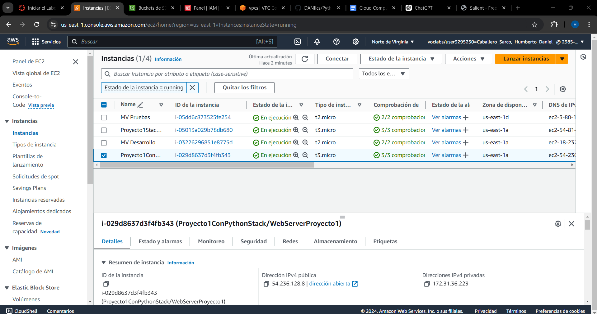
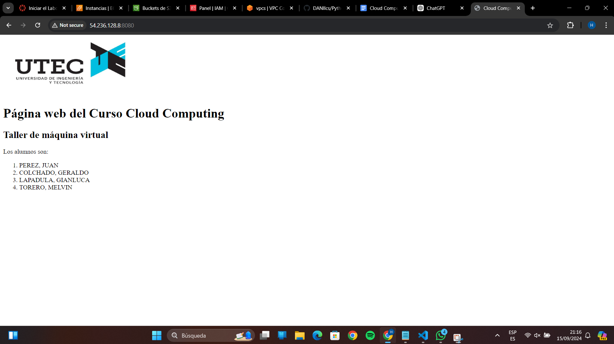
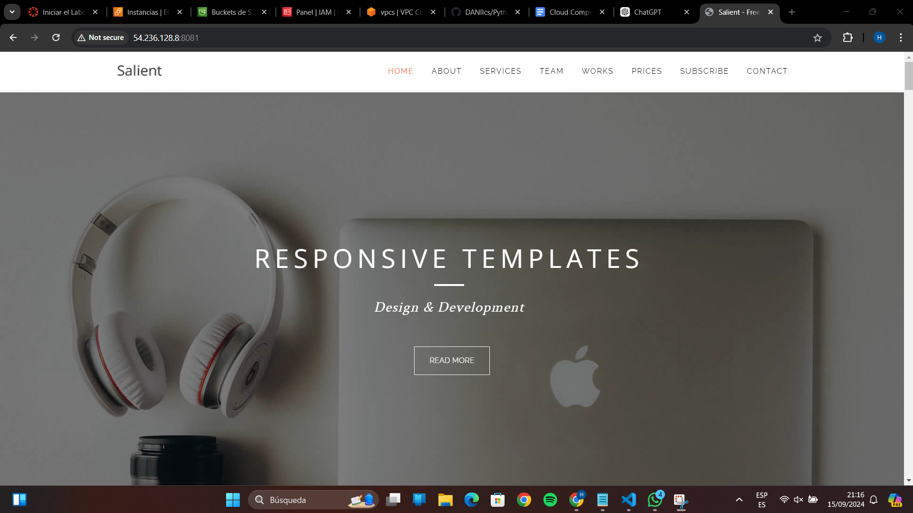

# Proyecto 1 de Cloud computing (Pyhton)

## Pasos a seguir:

Inicializamos el aws

Guadamos las credenciales en el directorio de .aws con el siguiente comando 

   ```bash
   notepad $env:USERPROFILE.aws\credentials
   ```

Buscamos nuestra id del AMI

Buscamos tambien la id del panel VPC



Creamos un archivo en vscode de python con los sigueintes comandos 

   ```bash
    pip install aws-cdk-lib

    cdk init app --language python
   ```

Ajustamos el codigo de tal manera que utilice las credenciales y tenaga los roles establecidos para que pueda abirir los puertos 8080 y 8081
Utilizamos el siguiente codigo para definir el `synthesizer` con los roles y el bucket especificado que queremos crear

    ```bash
    synthesizer = cdk.DefaultStackSynthesizer(
        file_assets_bucket_name="proyecto-cloud",
        bucket_prefix="",
        cloud_formation_execution_role="arn:aws:iam::298526054328:role/LabRole",
        deploy_role_arn="arn:aws:iam::298526054328:role/LabRole",
        file_asset_publishing_role_arn="arn:aws:iam::298526054328:role/LabRole",
        image_asset_publishing_role_arn="arn:aws:iam::298526054328:role/LabRole"
    )
    ```

Usamos los siguietes comando para deployar

   ```bash
   cdk deploy
   ```

Comporbamos que se haya deployado una nueva instancia en nuestro ec2



Uilizamos el id de esta instancia y comprobamos con los puertos establecidos





